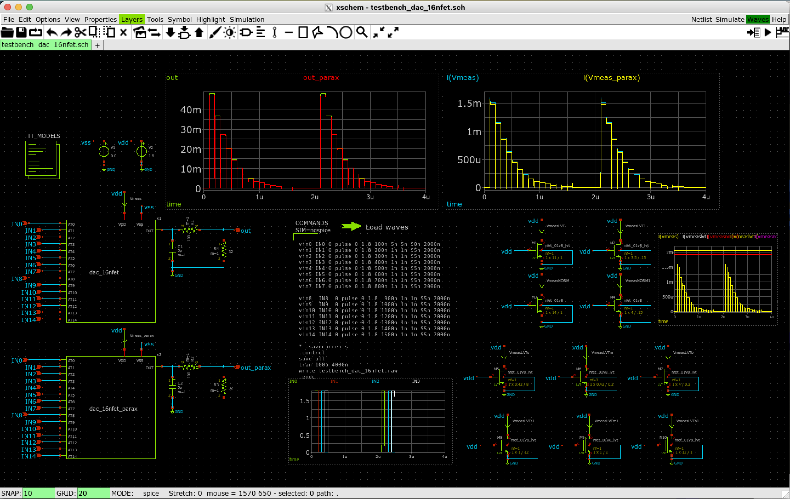

 

# Analog DAC for AY-891x family of Programmable Sound Generators

Recreation of the logarithmic 4-bit current steering DAC from AY-8910/AY-8912/AY-8913. Inspired and informed by silicon [reverse engineering](https://github.com/lvd2/ay-3-8910_reverse_engineered) of the orginal chip.

This work was done as excercise for [Zero To ASIC Analog course](https://zerotoasiccourse.com/#asic-def) and will be part of the open-source silicon for [AY-8913](https://github.com/rejunity/tt07-psg-ay8913-with-analog-dac) and potentially [SN76489](https://github.com/rejunity/tt05-psg-sn76489) unless I manage BJT DAC for it. Also check open-source silicon effort for [Z80](https://github.com/rejunity/z80-open-silicon) CPU.

### Silicon

<p align="center" width="100%">
    
</p>

- [Inspect chip in 3D](https://gds-viewer.tinytapeout.com/?model=https://rejunity.github.io/tt07-analog-dac-ay8913/tinytapeout.gds.gltf)
- [Inspect schematics](https://xschem-viewer.com/?file=https%3A%2F%2Fgithub.com%2Frejunity%2Ftt07-analog-dac-ay8913%2Fblob%2Fmain%2Fxschem%2Fdac_16nfet.sch)
- [Read the documentation for the project](docs/info.md)

### Simulation with parasytics extracted


## The original DAC from the 80ies
4-bit to 16 lines decoder on the left side. 16 current steering transistors of the different size form the DAC on the right. Output is in the top right corner.
<p align="center" width="100%">
    
</p>

### Reverse engineered schematics by lvd2
Yeah, it is just bunch of transistors connected in parallel. The real magic is in the **width** & **length** of their gates.
<p align="center" width="100%">
    
</p>

### Compare old and new


## Magic


<p align="center" width="100%">
    
    
    
</p>

# What did I learn?

## Sizing transistors to produce exact currents: 2mA, 1.4mA, 1mA, 0.7mA, 0.5mA...

First of all, it turns out that there are so many secondary effects, that the theoretical formula `W/L=2 * Id / (uCox * (Vdd-Vth)^2)` often presented in books becomes practically useless!

The W/L ratio of the gate is non-linear in regards to desired current. 4/2 != 2/1 != 1/0.25 in terms of current. Thinner the gate (in absolute values), stronger are various secondary effects and more resulting current deviates from the theory.

I could not find SKY130 documentation how to model these effects, but I could find some clues in:
* https://skywater-pdk.readthedocs.io/en/main/rules/device-details.html -- (bit cryptic) tables are very illustrative about non-linear effect of W/L on Vth.
* `sky130A/libs.tech/combined/continuous/models_fet.spice`  -- Vth0 depends on W/L in some weird ways, perhaps Cox as well.

See how Vth (threshold voltage) depends on W/L, ranging from 0.434V to 0.64V.


Check out what they have in models_fet.spice though, even weirder: 


From my experiments it is very likely that W/L affects not only Vth, but Cox as well.

## Short channel effects

The behaviors above are actually called [Short chanel effects](https://en.wikipedia.org/wiki/Short-channel_effect) and [Reverlse short-channel effect](https://en.wikipedia.org/wiki/Reverse_short-channel_effect)!

## Practical solution
I started using gates that are much larger (fatter and longer) than the theory would give me. Making gates larger significantly reduced the secondary effects!

I picked, partially through calculation, partially through experimentation, the sizes for my maxmimum (2mA) and minimum currents (16uA). Which turned out to be really nice numbers 12/1 and 1/12 😎 and used super simple Python script to fit exponential curve through them: ```for i in range(8): print(12*(0.707**i)```

I thought I would have to wiggle the gate sizes in the middle, but it just worked out as is.

If I had my transistors even slightly smaller, it would not be that easy! Right now they are approximately x3 larger than theoretically necessary.

## Some observation on the original DAC in AY-8913


1) Now I see that the 3 "middle" transistors don't exactly follow the pattern and perhaps original designers had to wiggle their W/L ratio.
2) Even the smallest current steering DAC gate is significantly larger than the logic gates next to them (see the image below), even if they control relatively tiny currents. I assume the original designers might have done the same - just make all DAC transistors larger to make it easier to "fit" in the exponential curve without significant distortions.
3) It also could explain why couple of "steps" are bit off from the spec in the original chip.


# What is Tiny Tapeout?

Tiny Tapeout is an educational project that aims to make it easier and cheaper than ever to get your digital designs manufactured on a real chip.

To learn more and get started, visit https://tinytapeout.com.

## Analog projects

For specifications and instructions, see the [analog specs page](https://tinytapeout.com/specs/analog/).

## Resources

- [FAQ](https://tinytapeout.com/faq/)
- [Digital design lessons](https://tinytapeout.com/digital_design/)
- [Learn how semiconductors work](https://tinytapeout.com/siliwiz/)
- [Join the community](https://tinytapeout.com/discord)
- [Build your design locally](https://docs.google.com/document/d/1aUUZ1jthRpg4QURIIyzlOaPWlmQzr-jBn3wZipVUPt4)
